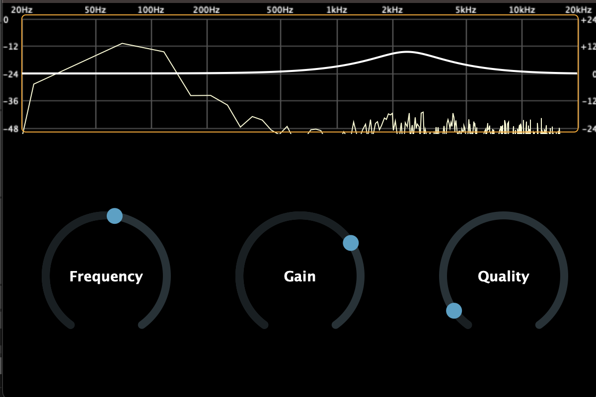

# Monoband EQ Plugin with Frequency Analyzer
A monoband equalizer plugin featuring a built-in frequency analyzer. This plugin allows users to adjust the gain of a single frequency band while visualizing the audio spectrum in real-time. For use in your DAW (digital audio workstation) of choice.

## Features:

### Monoband Equalization: 
Adjust the gain of a specific frequency band.

### Real-Time Frequency Analyzer: 
Visualize the audio spectrum as you make adjustments.

### User-Friendly Interface: 
Intuitive controls for ease of use.

### Cross-Platform Support: 
Compatible with major DAWs on Windows and macOS.

## Installation:

### Prerequisites:

JUCE Framework: Version 6 or higher (must be installed manually).

CMake: Version 3.15 or higher.

Git: For cloning the repository.

Supported DAW: Any Digital Audio Workstation that supports VST3 plugins.
Installing JUCE
Download JUCE:

### Clone the JUCE repository:

git clone https://github.com/juce-framework/JUCE.git /path/to/JUCE
Or download it from the official website.

Copy Juce folder into main project directory

### Clone the project repository:

git clone https://github.com/yourusername/MonobandEQPlugin.git

### Navigate to project directory:

cd MonobandEQPlugin

### Create Build Directory:

mkdir build
cd build

### Configure the Project with CMake:

cmake -DJUCE_DIR=/path/to/JUCE

Modify Your CMakeLists.txt to include the juce directory

### Build the plugin:

cmake --build .

Copy the compiled plugin file (.vst3 or .component) to your DAW's plugin directory.

macOS: ~/Library/Audio/Plug-Ins/VST3/

Windows:
VST3: C:\Program Files\Common Files\VST3\

## Usage:
### Load the Plugin: 
Open your DAW and load the Monoband EQ plugin.

Adjust the Frequency Band: Use the on-screen controls to adjust the gain.
Watch the frequency analyzer update in real-time!

## Acknowledgments:
This project is heavily based on an existing EQ plugin tutorial by Matkatmusic. I would like to acknowledge the original work and express gratitude for the foundational structure it provided. As a beginner in audio programming, this project would have been impossible without guidance.

Original Project Tutorial:
https://www.youtube.com/watch?v=i_Iq4_Kd7Rc&t=15798s

Author: Matkatmusic

Contributions are welcome! Please open an issue or submit a pull request for any improvements.
